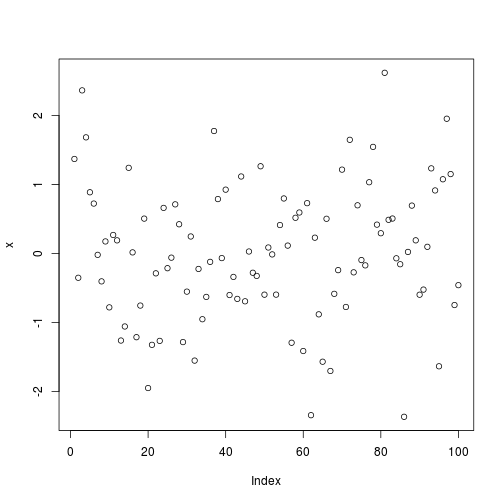
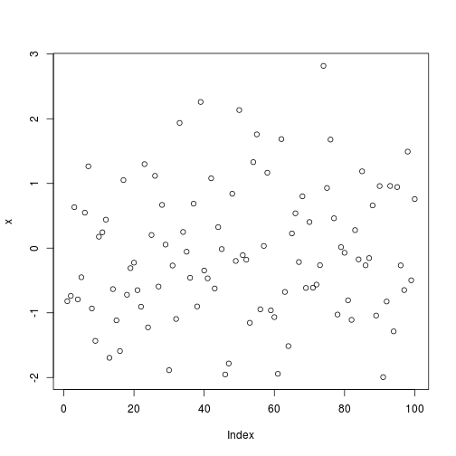
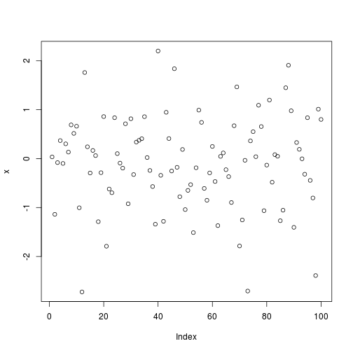

# A short introduction
In this assignment I will be learning how to start coding in R and using R studio. I have used the pdf A [(very) short
introduction to R](https://cran.r-project.org/doc/contrib/Torfs+Brauer-Short-R-Intro.pdf) by 
Paul Torfs & Claudia Brauer. In this pdf they will described the basic funcionality of R and the use of it also it gives an opportunity to learn R by  doing the ToDo's in this document.

------------------

# Todo 1

```r
((2016-2014)/(2016-1994))*100
```

```
## [1] 9.090909
```


# Todo 2

```r
a <- 2016-2014
b <- (2016-1994)
b <- a / b
b <- (b * 100)
b
```

```
## [1] 9.090909
```

# Todo 3

```r
x <- c(4,5,8,11)  
sum(x)
```

```
## [1] 28
```
# Todo 4

```r
x = rnorm(100)
plot(x)
```


# Todo 5

```r
help(sqrt)
```
# Todo 6

```r
source("~/Desktop/firstscript.R")
```



```r
source("~/Desktop/firstscript.R")
```



# Todo 7

```r
p <- c(31:60)
Q=matrix(data=c(31:60),ncol=5,nrow=6)
```
# Todo 8

```r
v=data.frame(x = c(1:100), y = c(1:100), z = c(1:100))
v
```

```
##       x   y   z
## 1     1   1   1
## 2     2   2   2
## 3     3   3   3
## 4     4   4   4
## 5     5   5   5
## 6     6   6   6
## 7     7   7   7
## 8     8   8   8
## 9     9   9   9
## 10   10  10  10
## 11   11  11  11
## 12   12  12  12
## 13   13  13  13
## 14   14  14  14
## 15   15  15  15
## 16   16  16  16
## 17   17  17  17
## 18   18  18  18
## 19   19  19  19
## 20   20  20  20
## 21   21  21  21
## 22   22  22  22
## 23   23  23  23
## 24   24  24  24
## 25   25  25  25
## 26   26  26  26
## 27   27  27  27
## 28   28  28  28
## 29   29  29  29
## 30   30  30  30
## 31   31  31  31
## 32   32  32  32
## 33   33  33  33
## 34   34  34  34
## 35   35  35  35
## 36   36  36  36
## 37   37  37  37
## 38   38  38  38
## 39   39  39  39
## 40   40  40  40
## 41   41  41  41
## 42   42  42  42
## 43   43  43  43
## 44   44  44  44
## 45   45  45  45
## 46   46  46  46
## 47   47  47  47
## 48   48  48  48
## 49   49  49  49
## 50   50  50  50
## 51   51  51  51
## 52   52  52  52
## 53   53  53  53
## 54   54  54  54
## 55   55  55  55
## 56   56  56  56
## 57   57  57  57
## 58   58  58  58
## 59   59  59  59
## 60   60  60  60
## 61   61  61  61
## 62   62  62  62
## 63   63  63  63
## 64   64  64  64
## 65   65  65  65
## 66   66  66  66
## 67   67  67  67
## 68   68  68  68
## 69   69  69  69
## 70   70  70  70
## 71   71  71  71
## 72   72  72  72
## 73   73  73  73
## 74   74  74  74
## 75   75  75  75
## 76   76  76  76
## 77   77  77  77
## 78   78  78  78
## 79   79  79  79
## 80   80  80  80
## 81   81  81  81
## 82   82  82  82
## 83   83  83  83
## 84   84  84  84
## 85   85  85  85
## 86   86  86  86
## 87   87  87  87
## 88   88  88  88
## 89   89  89  89
## 90   90  90  90
## 91   91  91  91
## 92   92  92  92
## 93   93  93  93
## 94   94  94  94
## 95   95  95  95
## 96   96  96  96
## 97   97  97  97
## 98   98  98  98
## 99   99  99  99
## 100 100 100 100
```
# Todo 9

```r
help("rgb")
```
# Todo 10

```r
d = data.frame(a = c(3,4,5),b = c(12,43,54))
write.table(d,file="txt1.txt",row.names=FALSE)
d2 = read.table(file="txt1.txt",header=TRUE)
```

# Todo 11

```r
c=data.frame=c(1:100,1)
c^2
```

```
##   [1]     1     4     9    16    25    36    49    64    81   100   121
##  [12]   144   169   196   225   256   289   324   361   400   441   484
##  [23]   529   576   625   676   729   784   841   900   961  1024  1089
##  [34]  1156  1225  1296  1369  1444  1521  1600  1681  1764  1849  1936
##  [45]  2025  2116  2209  2304  2401  2500  2601  2704  2809  2916  3025
##  [56]  3136  3249  3364  3481  3600  3721  3844  3969  4096  4225  4356
##  [67]  4489  4624  4761  4900  5041  5184  5329  5476  5625  5776  5929
##  [78]  6084  6241  6400  6561  6724  6889  7056  7225  7396  7569  7744
##  [89]  7921  8100  8281  8464  8649  8836  9025  9216  9409  9604  9801
## [100] 10000     1
```
# Todo 12

```r
data=strptime( c("20140706080000","20165704000000"),format="%Y%m%d%H%M%S")
data=x
plot(x)
```


# Todo 13
This todo didn't compile 

### Sources used for this assignment:

[nicercode github](http://nicercode.github.io/guides/reports/)

[Kbroman.org markdown](http://kbroman.org/knitr_knutshell/pages/markdown.html)

[R markdown cheat sheet](https://www.rstudio.com/wp-content/uploads/2015/02/rmarkdown-cheatsheet.pdf)

[rmarkdown Rstudio](http://rmarkdown.rstudio.com/)


